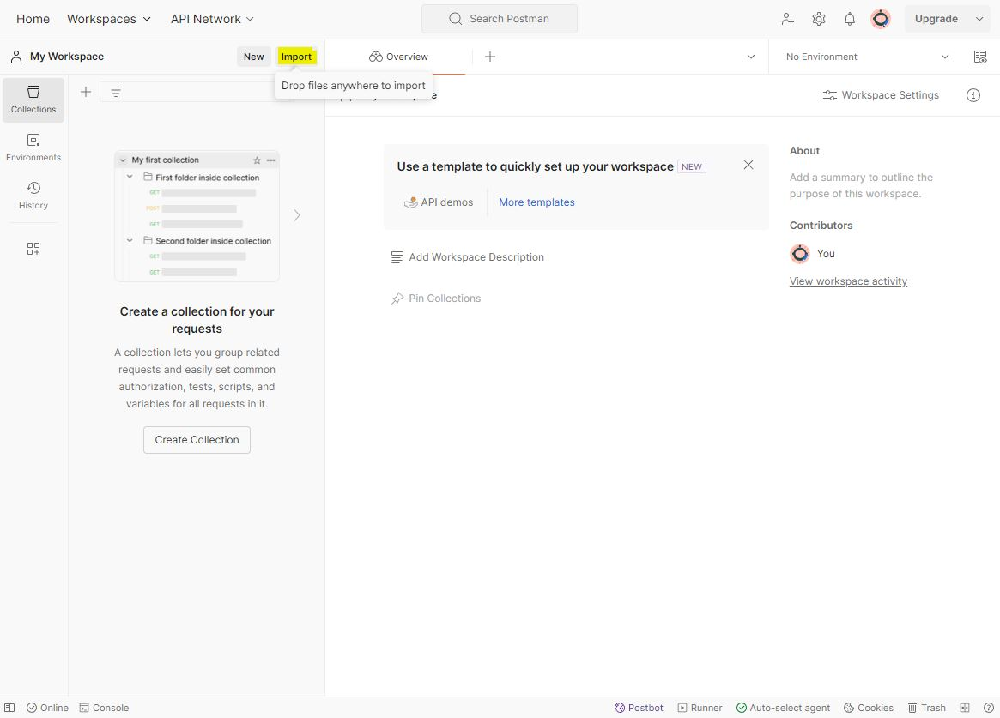

# testCases_240219

## Test Cases for Sogeti Interview Test

- All tests were created with Windows 10 OS, PyCharm IDE, Postman Web Browser Platform
- Other operating systems or IDEs have not been tested

### Requirements

- Windows 10 OS
- Python
- Python IDE
- Selenium
- Free Postman Account

## Python

### Install Python

- open command line with admin rights
- type in:

> cd C:\
> python

Microsoft Store will now open Python 3.12 download page
- Click Get on the  Python 3.12 page
- Python 3.12 will be installed

After installation you can optionally run following in CMD to see installed files

> pip list

## Python IDE

### Installation of PyCharm

- Download community version of PyCharm
    - https://www.jetbrains.com/pycharm/download/
- Run the installer exe after download to install PyCharm

### Open UI test directory

- Open PyCharm
- open the linked test directory from the git repository
	-  [UI Test Directory](/testCases/API%20Tests)

If not included in the repository it may be required to install Selenium into the environment.  
Therefore navigate to the terminal and enter:  

> pip install selenium

### Open and run tests 1..3

- Open "testCase1.py" from the navigation bar
- right-click into the PyCharm IDE
- select "Run 'testCase1'"

Chrome Browser will now open up and follow the instructions from the test script automatically.   
I recommend not to navigate or click anything while the test is running.  
The results of the performed test will appear in the PyCharm console

Repeat procedure again with test cases 2 and 3.  
Choose "testCase2.py" and "testCase3.py" and run each test.  
Again, Chrome Browser will open and run the tests while results will be printed on the PyCharm console

### Results of tests 1...3

#### Test Case 1

Steps 1 until 3 worked fine.  
The last step (4) will not work as intended.  
Unfortunately the navigation bar element "Services" and also the element "Automation" in the expanded menu are not recognized as active, although they are visibly selected.
I tried "selected" & "enabled" commands which both did not work.

#### Test Case 2

Steps 1 until 5 worked fine.  
In step 4 another input field and one dropdown menu had to be tested additionally.  
- Company text field
- Country selection

Also inputs have not been totally random:  
For the email input obligatory "@" character had to be added as well as a valid ending like ".com".  
As phone number a random disconnected number was chosen (only the last three digits are random).  
After step 5 a reCaptcha box had to be clicked in order to submit the contact request.  
Unfortunately, after to many tries to click onto the reCaptcha element I could not go on to the next step.  
Trying again after a certain ammount time or run tests from a different system reCaptcha may be successfully passed.

#### Test Case 3

All steps passed.

## Postman Web Browser Platform

A account is required to use Postman

- Create a free account on
    - https://www.postman.com/
- Sign in after creating account
- Open Postman Web Platform on
    - https://go.postman.co/homenull

### Import Postman API Tests

Postman Test Cases have been exported in a JSON file
All API tests can be imported by using the provided file from the repository
- [see linked file](./testCases/API%20Tests/Sogeti%20API%20Test.postman_collection.json)  

- Open your Workspace

- Click 'Import' on left navigation bar
- Import this file: ([Sogeti API Test.postman_collection.json](./testCases/API%20Tests/Sogeti%20API%20Test.postman_collection.json))
- Click OK

All API test cases should be imported and ...  

you will now see the directory "Sogeti API Test" with testCase4 and ..5 in your Workspace

### Run Test Case 4

To run testCase4 proceed as follows:

- click "testCase4" and move to the "Tests" register to see the testing script
- click "Send" to run the test
- results will be shown below under "Test Results"

### Run Test Case 5

As this case is data driven "Body" and the "Runner"(Run Collection) have to be configured  

Click the testCase5 register and navigate to "Body" to see the added variables inside the JSON body and also the added endpoints in the URL  

- move to "Tests" to see the test script

- right-click onto the 3-dots button on "Sogeti API Test"
- click Run Collection
- only tick the checkbox of testCase5
- import configuration file by selecting from repository
	- [Select testCase5post.json](./testCases/API%20Tests/testCase5post.json)
	

- click "Run Sogeti API Test"

Now all data from the uploaded JSON file will be posted to the new endpoints.  
Results from the performed tests will appear automatically.  

### Results of tests 4..5

#### Test Case 4

Steps 1..3 passed.  
In Step 4 the test did fail.  
In the tested JSON file there are equal place names with different postal areas.  
The program did find the first entry with the right name which has a different post code.  

#### Test Case 5

Unfortunately I was not able to create a sufficient data driven test for this case.  
This was the first time I did data driven API testing so I am not yet sure how to solve this task.  
